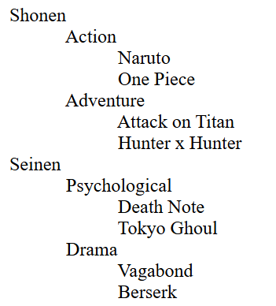
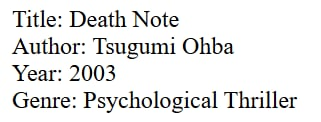
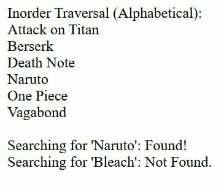
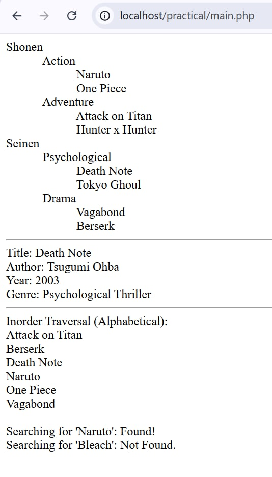

# php-foundations-datastructures-CorpuzJ

# Manga Library 

# Project Purpose
This project demonstrates how to organize and display anime and manga titles using PHP.  
It includes:

1. **Recursion** – Display categories, subcategories, and books.  
2. **Hash Table** – Store book details (author, year, genre) and search by title.  
3. **Binary Search Tree (BST)** – Store book titles alphabetically and search efficiently.  
4. **Main Integration** – Combine all parts into a single file.

---

## Step-by-Step Guide

### Step 1: Recursion – Display Library
**File:** `recursion.php`  
- Defines categories and books in arrays.  
- Uses recursion to display the library structure.  
**How to Run This Part:**  
1. Place `recursion.php` in your PHP server folder.  
2. Open it in a browser (via XAMPP, MAMP, Laragon, or another PHP environment).  
3. You will see the library categories and books displayed. 

**OUTPUT:**




### Step 2: Hash Table – Book Details
**File:** `hashtable.php`  
- Stores book details in an associative array.  
- Use `getBookInfo("Book Title", $bookInfo);` to search.  
**How to Run This Part:**  
1. Place `hashtable.php` in your PHP server folder.  
2. Open it in a browser.  
3. You will see the details of the book searched.

**OUTPUT:**



### Step 3: Binary Search Tree (BST)
**File:** `bst.php`  
- Stores book titles in a BST.  
- Performs alphabetical traversal (`inorderTraversal`) and search (`search`).  
**How to Run This Part:**  
1. Place `bst.php` in your PHP server folder.  
2. Open it in a browser.  
3. You will see sorted book titles and search results.

**OUTPUT:**



### Step 4: Main Integration
**File:** `main.php`  
- Includes all three files: `recursion.php`, `hashtable.php`, `bst.php`.  
**How to Run This Part:**  
1. Place `main.php` and all included files in the same PHP server folder.  
2. Open `main.php` in a browser.  
3. You will see the library, book search, and BST traversal together.

**OUTPUT:**


---

## Adding Screenshots/Images in README
1. Save your screenshot in a folder in your repo, e.g., `screenshots/`.  
2. Use Markdown syntax to add it:

```markdown

